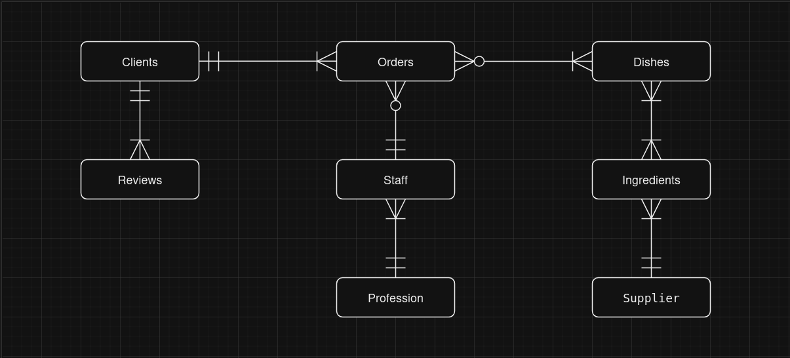
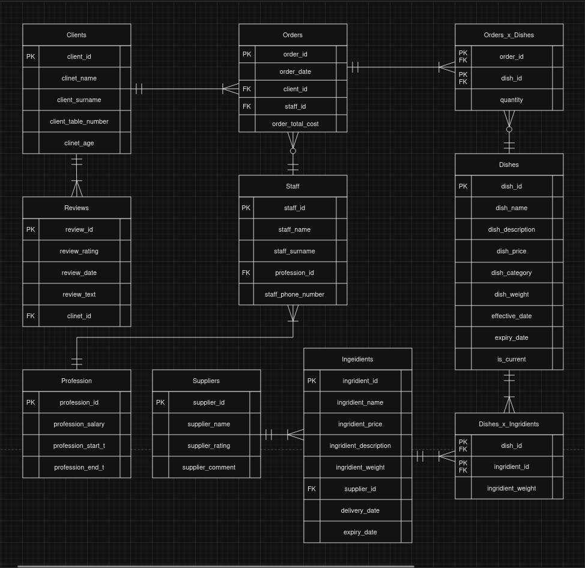
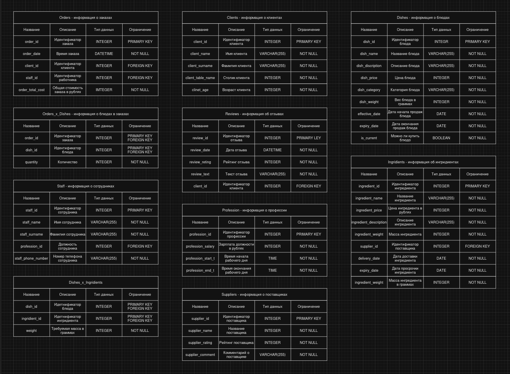

# Проект по базам данных
Темой проекта был выбран обычный ресторан, мы постораемся смоделировать его деятельность на протяжении какого-то времени с помощью базы данных и языка программирования PostgreSQL.

## Защита темы. Выбор сущностей
Сущностями были выбраны: Клиенты, Отзывы, Сотрудники, Заказы, Професии, Блюда, Ингредиенты и Поставщики. Каждая из этих сущностей важна в работе ресторана и большинство вещей, происходящих с рестораном можно описать через эти сущности и их атрибуты.

## Концептуальная модель
Концептуальная модель была создана в виде таблицы, на которой изображены сущности и взаимоотношения между ними.

## Логическая модель
Логическая модель была создана путем добавления атрибутов в талицы и выделения первичных и внешних ключей. Для нормализации выбрана третья нормальная форма, поэтому появились таблицы Orders_x_Dishes и Dishes_x_Ingredients.

## Физическая модель 
Физическая модель представляет множество таблиц, каждая их которых репрезентует базу данных, так же в ней показаны типы данных и все ограничения.

## Реализация таблицы и её заполнение
С помощью PostgreSQL создадим все таблицы и зададим отношение между ними. [Инициализация.](first_part/initialization.sql)

Далее заполним каждую из таблиц данными. [Заполнение.](first_part/insertion.sql)

## Написание 10 осмысленных запросов
Ожидаемый вывод всеъ скриптов написан прямо в файле, запросы содержат WHERE, GROUP BY, HAVING, ORDER BY, JOIN, подзапросы. [Запросы.](first_part/requests.sql)

## Создание представлений
Представления созданы для тех таблиц, в которых станет гораздо удобнее работать, если сгруппировать данные из нескольких таблиц. [Представления.](second_part/views.sql)

## Создание индексов
Индексы созданы для тех таблиц и атрибутов, которые используются чаще всего, чтобы ускорить исполнение запросов. Проводить индексирование для всех таблиц не стоит для экономии памяти. [Индексирование](second_part/indexing.sql)

## Создание хранимых процедур или функций
Ожидаемый вывод всех скриптов написан прямо в файле, функции и процедуры созданы таким образом, чтобы они могли быть удобными и применимыми для сотрудников. [Процедуры и функции](second_part/functions%20and%20procedures.sql)